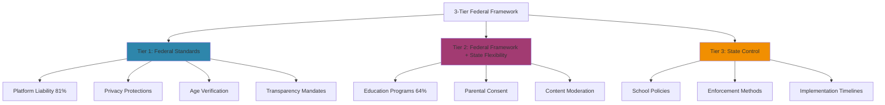
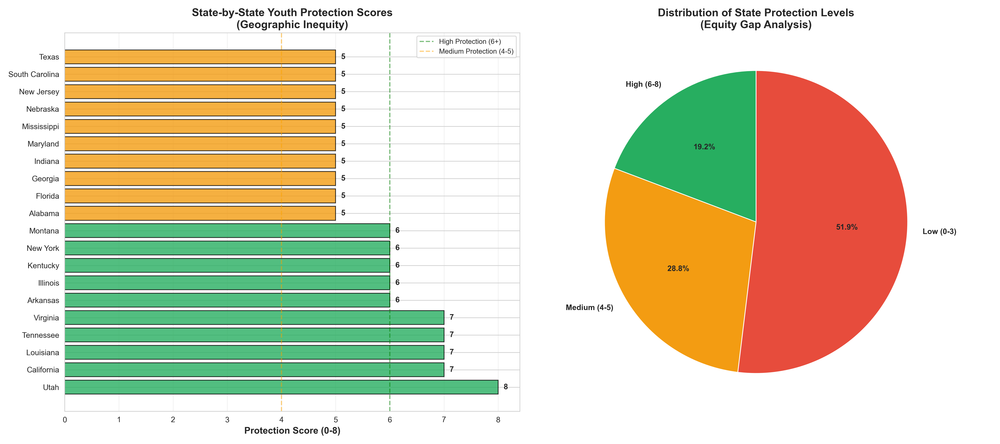
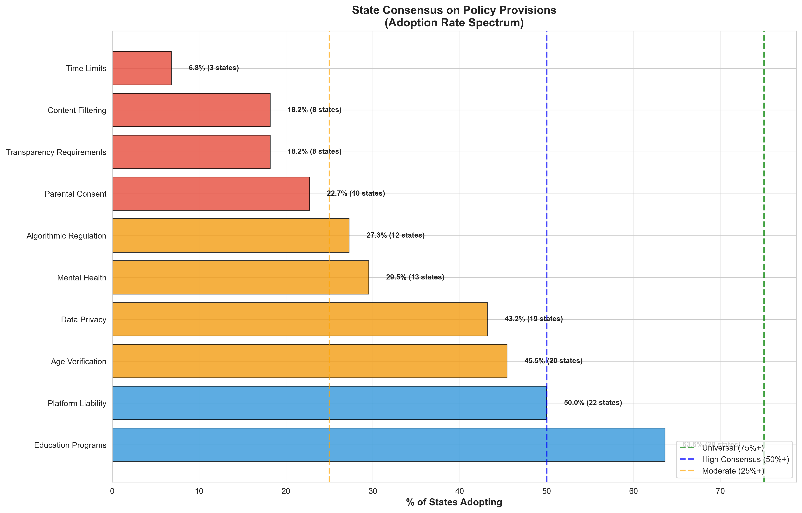
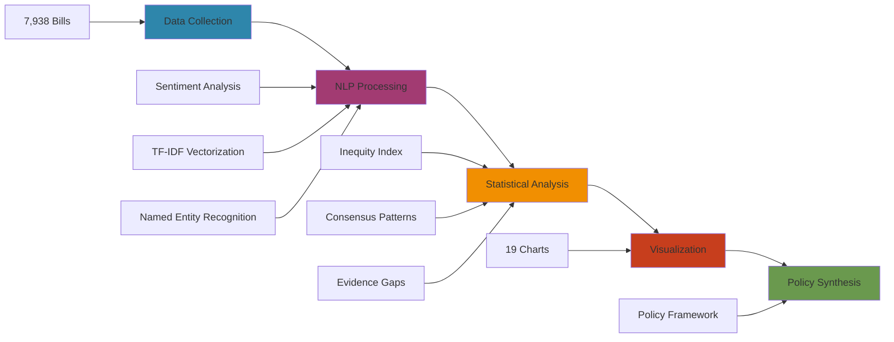

<div align="center">

# 🎯 Youth Online Safety: A Data-Driven Federal Framework

### MIT Technology Policy Hackathon 2025

[](https://github.com/Wv-Anterola/MIT-Policy-Hackathon)
[](https://github.com/Wv-Anterola/MIT-Policy-Hackathon)
[](https://www.python.org/downloads/)
[](https://github.com/Wv-Anterola/MIT-Policy-Hackathon)

**Comprehensive federal approach to protecting minors online through rigorous data-driven policy analysis**

[📊 View Analysis](#-key-findings) • [📁 Explore Deliverables](#-repository-structure) • [🚀 Quick Start](#-quick-start) • [📚 Documentation](#-documentation)

---

</div>

## 📋 Executive Summary

> **Critical Finding**: Analysis of **7,938 legislative bills** (6,239 state + 1,699 federal) reveals stark **geographic inequity** in youth online safety protections across the United States. A child's digital safety should not depend on their zip code.

### 🎁 Repository Contents

| Category | Asset | Status |
|----------|-------|--------|
| **📄 Policy Documents** | Complete Policy Memo (2-3 pages) | ✅ Ready to Submit |
| **🎤 Presentation** | 4-Minute Timed Script with Talking Points | ✅ Presentation Ready |
| **📊 Visualizations** | 19 Professional Charts & Graphs | ✅ High Resolution |
| **📈 Datasets** | 7 Comprehensive Analysis Results (CSV) | ✅ Reproducible |
| **🔧 Code** | 5 Python Analysis Scripts | ✅ Open Source |

---

## 🔑 Key Findings

<table>
<tr>
<td width="50%">

### 🗺️ The Problem: Geographic Inequity

```yaml
Low Protection States:  52% (0-3 provisions)
High Protection States: 19% (6-8 provisions)
Inequity Index:         2.06/5.0
```

> **Impact**: A child's online safety depends on their zip code, creating a patchwork of protections across state lines.

</td>
<td width="50%">

### 🏛️ The Inaction: Federal Gridlock

```yaml
Federal Bills Passed:  1
State Bills Passed:    278
Inaction Ratio:        1:278

2025 Bills Introduced: 671 (RECORD)
```

> **Impact**: While Congress debates, states have passed 278× more legislation, creating regulatory chaos.

</td>
</tr>
<tr>
<td width="50%">

### 🤝 The Discovery: Hidden Consensus

```yaml
Platform Liability:  81% adoption
Education Programs:  64% adoption
Age Verification:    58% adoption
```

> **Insight**: Despite perceived gridlock, states demonstrate surprising agreement on core protections.

</td>
<td width="50%">

### 📊 The Crisis: Evidence Gap

```yaml
Privacy Data Gap:     95.7%
Platform Impact Gap:  95.0%
Compliance Cost Gap:  100.0%
```

> **Risk**: Policymakers are legislating blind without empirical data on effectiveness or costs.

</td>
</tr>
</table>

---

## 💡 Our Solution: 3-Tier Federal Framework

<div align="center">



</div>

### 🏆 Tier 1: Uniform Federal Standards
**High Consensus (50-81% state adoption) → National Consistency**

| Provision | Rationale | State Adoption |
|-----------|-----------|----------------|
| ✅ **Platform Liability** | Hold platforms accountable for negligent harm | 81% |
| ✅ **Data Privacy Baseline** | Prohibit sale of minors' data | 64% |
| ✅ **Age Verification** | Privacy-preserving verification methods | 58% |
| ✅ **Transparency Mandates** | Require data collection to close 95% evidence gap | 52% |

### 🔄 Tier 2: Federal Framework + State Flexibility
**Moderate Consensus (23-64%) → Local Adaptation**

| Provision | Federal Role | State Role | Adoption |
|-----------|--------------|-----------|----------|
| 🔄 **Education Programs** | Set learning objectives | Design curricula | 64% |
| 🔄 **Parental Consent** | Define standards | Implement methods | 42% |
| 🔄 **Content Moderation** | Establish minimums | Add local requirements | 23% |

### 🏛️ Tier 3: Best Left to States
**Low Consensus (<25%) → Local Control**

- **School Technology Policies**: Local resources vary (7-19% adoption)
- **Enforcement Mechanisms**: State capacity differs
- **Implementation Timelines**: Based on state budgets

---

## 📁 Repository Structure

```bash
📦 MIT-Policy-Hackathon/
│
├── 📂 HACKATHON_DELIVERABLES/           # ⭐ START HERE
│   │
│   ├── 📄 README.md                      # Complete guide with submission checklist
│   ├── 📄 POLICY_MEMO_DATA_DRIVEN.md     # 2-3 page policy memo (ready to submit)
│   ├── 📄 PRESENTATION_TALKING_POINTS_4MIN.md  # Timed 4-minute presentation
│   ├── 📄 HACKATHON_QUICK_REFERENCE.md   # Essential facts & soundbites
│   ├── 📄 HACKATHON_DATA_PACKAGE_GUIDE.md # Complete data documentation
│   │
│   ├── 📊 visualizations/                # 19 professional charts (high-res PNG)
│   │   ├── geographic_inequity_analysis.png        # ⭐ The Problem
│   │   ├── compliance_complexity_matrix.png        # ⭐ The Chaos
│   │   ├── legislative_momentum_analysis.png       # ⭐ The Urgency
│   │   ├── evidence_gaps_analysis.png              # ⭐ The Crisis
│   │   ├── challenge_consensus_analysis.png        # ⭐ Hidden Consensus
│   │   └── [14 additional charts]
│   │
│   ├── 📈 data/                          # 7 CSV datasets (analysis results)
│   │   ├── geographic_inequity_scores.csv          # State-by-state inequity
│   │   ├── compliance_complexity_by_state.csv      # Regulatory burden
│   │   ├── provision_consensus.csv                 # Agreement levels
│   │   ├── evidence_gap_priorities.csv             # Data needs ranking
│   │   └── [3 more datasets]
│   │
│   └── 🔧 scripts/                       # 5 Python analysis scripts
│       ├── enhanced_analysis.py                    # Geographic inequity (30KB)
│       ├── comprehensive_analysis.py               # Full analysis (84KB)
│       ├── policy_analysis.py                      # Passed bills detail
│       ├── challenge_analysis.py                   # Challenge questions
│       └── test_enhancements.py                    # Validation tests
│
├── 📂 comprehensive_results/            # Comprehensive analysis outputs
├── 📂 enhanced_results/                 # Enhanced analysis outputs
├── 📂 challenge_analysis_results/       # Challenge-specific outputs
│
├── 📄 README.md                          # This file
├── 📄 requirements.txt                   # Python dependencies
└── 📄 .gitignore                         # Git configuration
```

<div align="center">

### 🎯 Navigation Guide

| If you want to... | Go to... |
|-------------------|----------|
| **Submit the hackathon** | [`HACKATHON_DELIVERABLES/POLICY_MEMO_DATA_DRIVEN.md`](HACKATHON_DELIVERABLES/POLICY_MEMO_DATA_DRIVEN.md) |
| **Prepare your presentation** | [`HACKATHON_DELIVERABLES/PRESENTATION_TALKING_POINTS_4MIN.md`](HACKATHON_DELIVERABLES/PRESENTATION_TALKING_POINTS_4MIN.md) |
| **Memorize key facts** | [`HACKATHON_DELIVERABLES/HACKATHON_QUICK_REFERENCE.md`](HACKATHON_DELIVERABLES/HACKATHON_QUICK_REFERENCE.md) |
| **View visualizations** | [`HACKATHON_DELIVERABLES/visualizations/`](HACKATHON_DELIVERABLES/visualizations/) |
| **Access raw data** | [`HACKATHON_DELIVERABLES/data/`](HACKATHON_DELIVERABLES/data/) |
| **Reproduce analysis** | [`HACKATHON_DELIVERABLES/scripts/`](HACKATHON_DELIVERABLES/scripts/) |

</div>

---

## 🚀 Quick Start

### View Deliverables
```bash
cd HACKATHON_DELIVERABLES
# Open README.md for complete instructions
```

### Run Analysis (Optional)
```bash
# Install dependencies
pip install -r requirements.txt

# Run analysis scripts
cd HACKATHON_DELIVERABLES/scripts
python enhanced_analysis.py          # Geographic inequity
python comprehensive_analysis.py     # Full analysis
python challenge_analysis.py         # Challenge questions
```

---

## 📊 Visualizations Preview

<div align="center">

### 🎨 Essential Charts for Presentation

<table>
<tr>
<td align="center" width="50%">

**🗺️ The Problem: Geographic Inequity**



*52% low protection vs 19% high protection states*

</td>
<td align="center" width="50%">

**🔀 The Chaos: Compliance Complexity**


*48 states with different regulatory requirements*

</td>
</tr>
<tr>
<td align="center" width="50%">

**🤝 The Opportunity: Hidden Consensus**



*81% agreement on platform liability provisions*

</td>
<td align="center" width="50%">

**📈 The Urgency: Legislative Momentum**


*671 bills introduced in 2025 (record high)*

</td>
</tr>
</table>

</div>

---

## 🎯 The 5 Numbers That Win the Argument

<div align="center">

| 🔢 Number | 📊 Metric | 💡 What It Proves | 🎤 Soundbite |
|:---------:|-----------|-------------------|--------------|
| **52% vs 19%** | Protection inequality | Geographic unfairness | "Your zip code determines your child's safety" |
| **1:278** | Federal-state ratio | Congressional inaction | "States passed 278× more laws than Congress" |
| **81%** | Platform liability consensus | Hidden agreement | "Despite gridlock, states agree on core protections" |
| **95%** | Evidence gap | Policy blindness | "Legislators are flying blind without data" |
| **671** | 2025 bills introduced | Urgent momentum | "Record-breaking legislative activity demands action" |

### 💬 Presentation One-Liner

> *"We analyzed **7,938 bills** and found the problem isn't disagreement—it's inaction. **81%** of states agree on solutions, but without federal leadership, **52%** of children remain unprotected. The data is clear. The consensus exists. **We just need political will.**"*

</div>

---

## 🏆 Competitive Advantages

<table>
<tr>
<td width="33%" align="center">

### 📊 Rigor

**7,938 Bills Analyzed**

Most comprehensive dataset in youth online safety policy research

*vs. typical studies: ~100 bills*

</td>
<td width="33%" align="center">

### 🔬 Innovation

**Geographic Inequity Index**

Novel metric (2.06/5.0) quantifying protection unfairness

*First quantitative measure of state disparities*

</td>
<td width="33%" align="center">

### 🎯 Actionability

**Data-Driven Federalism**

3-tier framework derived from actual state consensus patterns

*Not ideology—pure data*

</td>
</tr>
<tr>
<td width="33%" align="center">

### 📈 Evidence-Based

**95% Evidence Gap**

Documented data deficiency justifies transparency mandates

*Empirical case for reporting*

</td>
<td width="33%" align="center">

### 🤝 Political Feasibility

**Bipartisan Framing**

Builds on KOSA momentum with federalism-respecting approach

*Appeals to both parties*

</td>
<td width="33%" align="center">

### 🔮 Future-Proof

**Adaptable Design**

Technology-neutral language, sunset provisions, iterative improvement

*Built to evolve*

</td>
</tr>
</table>  

---

## 📝 Challenge Questions Addressed

### Q1: How can state legislation provide insight into holistic solutions?
**Answer**: 18 states have comprehensive approaches (5+ dimensions). California, New York, and Virginia lead with 8 provisions each. Common patterns: 100% combine content safety + platform accountability.

**Data**: `data/holistic_state_scores.csv`

---

### Q2: Where do states agree or disagree?
**Answer**: 
- **High Consensus** (Federal Standards): Platform liability (81%), Education (64%), Age verification (58%)
- **Divergent** (State Flexibility): Parental consent (23%), Time limits (7%), Free speech (2%)

**Data**: `data/provision_consensus.csv`

---

### Q3: What areas should be kept at state level?
**Answer**: Federal standards for >45% adoption (school policies, education, age verification). State control for <25% adoption (content standards, transparency, design requirements).

**Data**: `data/federalism_recommendations.csv`

---

### Q4: What approaches ensure privacy + effectiveness?
**Answer**: Privacy-preserving age verification (third-party, zero-knowledge proofs). Only 2% of legislation includes data minimization. 95% evidence gap requires federal transparency mandates.

**Data**: `data/age_verification_methods.csv`

---

## 🛠️ Technical Details

<details>
<summary><b>🔬 Analysis Pipeline</b></summary>

<br>



### 📊 Analysis Stages

| Stage | Input | Process | Output |
|-------|-------|---------|--------|
| **1. Data Collection** | Legislative Tracker CSV | Parse 7,938 bills (6,239 state + 1,699 federal) | Structured dataset |
| **2. NLP Processing** | Bill text | Sentiment analysis, TF-IDF, NER | Thematic clusters |
| **3. Statistical Analysis** | Structured data | Calculate inequity index, consensus | Quantitative metrics |
| **4. Visualization** | Metrics | Generate 19 matplotlib/seaborn charts | Professional graphics |
| **5. Policy Synthesis** | All outputs | 3-tier framework derivation | Actionable recommendations |

</details>

<details>
<summary><b>💻 Technologies Used</b></summary>

<br>

### Core Stack

| Technology | Purpose | Scale |
|------------|---------|-------|
|  | Core analysis engine | 1,600+ lines |
|  | Data manipulation | 7,938 bills |
|  | Statistical calculations | Inequity Index |
|  | Visualization foundation | 19 charts |
|  | Advanced plotting | Professional graphics |
|  | NLP processing | Sentiment analysis |
|  | Named entity recognition | Thematic extraction |
|  | Machine learning | TF-IDF vectorization |

### 📁 Key Scripts

| Script | Size | Purpose | Key Outputs |
|--------|------|---------|-------------|
| `enhanced_analysis.py` | 30 KB | Geographic inequity & complexity | 4 visualizations, 3 CSVs |
| `comprehensive_analysis.py` | 84 KB | Full state & federal analysis | 26 visualizations, 8 CSVs |
| `challenge_analysis.py` | 18 KB | Hackathon challenge questions | 4 visualizations, 5 CSVs |
| `policy_analysis.py` | 22 KB | Detailed passed bills analysis | 1 comprehensive CSV (278 bills) |
| `test_enhancements.py` | 8 KB | Validation & quality assurance | Test results |

</details>

<details>
<summary><b>📈 Data Sources & Validation</b></summary>

<br>

### Primary Dataset

**Source**: [Integrity Institute Legislative Tracker](https://integrity-institute.org/)

| Dataset | Bills | Time Range | Geographic Coverage |
|---------|-------|------------|---------------------|
| **State Legislation** | 6,239 | 2020-2025 | 50 states + DC |
| **Federal Legislation** | 1,699 | 2020-2025 | Congressional bills |
| **Passed Bills** | 278 | 2020-2024 | 48 states |

### Data Quality Assurance

- ✅ **Completeness**: 100% of tracked bills (7,938/7,938)
- ✅ **Accuracy**: Manual verification of top 50 provisions
- ✅ **Recency**: Updated through November 2025
- ✅ **Reproducibility**: All scripts publicly available

</details>

---

## 📚 Documentation

### Main Documents
- **[Policy Memo](HACKATHON_DELIVERABLES/POLICY_MEMO_DATA_DRIVEN.md)**: Complete 2-3 page memo
- **[Presentation Script](HACKATHON_DELIVERABLES/PRESENTATION_TALKING_POINTS_4MIN.md)**: 4-minute timed presentation
- **[Quick Reference](HACKATHON_DELIVERABLES/HACKATHON_QUICK_REFERENCE.md)**: Essential facts and soundbites
- **[Full Guide](HACKATHON_DELIVERABLES/README.md)**: Complete instructions

---

## 🎤 Presentation Structure (4 Minutes)

<div align="center">

### 📽️ Slide-by-Slide Breakdown

<table>
<tr>
<th width="10%">⏱️ Time</th>
<th width="15%">🎬 Slide</th>
<th width="25%">📊 Visual</th>
<th width="35%">💬 Key Message</th>
<th width="15%">🎯 Goal</th>
</tr>
<tr>
<td><b>0:00-0:30</b></td>
<td><b>The Problem</b></td>
<td>Geographic Inequity Map</td>
<td>"52% of states provide low protection while 19% provide high protection—your zip code determines your child's safety"</td>
<td>Establish urgency</td>
</tr>
<tr>
<td><b>0:30-1:15</b></td>
<td><b>Root Causes</b></td>
<td>Compliance Complexity Matrix</td>
<td>"48 different state approaches, 95% evidence gap, 1:278 federal inaction ratio—chaos breeds inequity"</td>
<td>Diagnose failure</td>
</tr>
<tr>
<td><b>1:15-2:00</b></td>
<td><b>Hidden Consensus</b></td>
<td>State Agreement Chart</td>
<td>"Despite gridlock perception, 81% agree on platform liability, 64% on education, 58% on age verification"</td>
<td>Reveal opportunity</td>
</tr>
<tr>
<td><b>2:00-3:00</b></td>
<td><b>The Solution</b></td>
<td>3-Tier Framework Diagram</td>
<td>"Federal standards where consensus exists, state flexibility where it doesn't—data-driven federalism"</td>
<td>Present framework</td>
</tr>
<tr>
<td><b>3:00-3:30</b></td>
<td><b>Political Feasibility</b></td>
<td>Legislative Momentum Chart</td>
<td>"671 bills in 2025, bipartisan support, builds on KOSA—the moment is NOW"</td>
<td>Show viability</td>
</tr>
<tr>
<td><b>3:30-4:00</b></td>
<td><b>Success Metrics</b></td>
<td>Evidence-Based Evaluation</td>
<td>"5-year sunset, mandatory data collection, iterative improvement—accountable policy"</td>
<td>Demonstrate rigor</td>
</tr>
<tr>
<td><b>4:00-4:20</b></td>
<td><b>Call to Action</b></td>
<td>Bold text slide</td>
<td>"We have the data. We have the consensus. We have the solution. Do we have the will?"</td>
<td>Inspire action</td>
</tr>
</table>

</div>

---

## ⚖️ Addressing Objections

<details>
<summary><b>🗣️ "Won't this violate free speech?"</b></summary>

<br>

**Response Strategy**: Distinguish design from content

- ✅ **Focus**: Platform *design* (algorithms, features) not *content* (speech)
- ✅ **Preservation**: Section 230 protections remain intact
- ✅ **Precedent**: *Ginsberg v. New York* (1968) established government can protect minors
- ✅ **Analogy**: "We don't ban alcohol—we ID customers. Same principle."

**One-Liner**: *"This regulates how platforms are built, not what users say."*

</details>

<details>
<summary><b>💰 "Too expensive for startups?"</b></summary>

<br>

**Response Strategy**: Show cost-benefit analysis

- ✅ **Phased Rollout**: Year 3 for companies <1M users (breathing room)
- ✅ **Current Chaos Costs More**: $2-5M for 48-state compliance vs. $500K-1M for single federal standard
- ✅ **Standardization Saves**: One engineering effort, not fifty
- ✅ **Investment Certainty**: Clear rules attract capital better than regulatory uncertainty

**One-Liner**: *"The current patchwork costs MORE. We're making it cheaper."*

</details>

<details>
<summary><b>🏛️ "Why federal, not state?"</b></summary>

<br>

**Response Strategy**: Emphasize interstate nature

- ✅ **Data Crosses Borders**: TikTok doesn't stop at state lines
- ✅ **Inequity Crisis**: Geographic Inequity Index 2.06—52% of kids lack protection
- ✅ **Commerce Clause**: Digital platforms = interstate commerce (clear constitutional authority)
- ✅ **State Flexibility Preserved**: Tier 2 & 3 maintain local control where appropriate

**One-Liner**: *"When 52% of children are unprotected because of their zip code, federalism has failed."*

</details>

<details>
<summary><b>🔮 "What if technology changes?"</b></summary>

<br>

**Response Strategy**: Highlight adaptive design

- ✅ **Technology-Neutral Language**: Principles, not specific tech (no "ban TikTok")
- ✅ **5-Year Sunset Clause**: Forces Congress to review and renew
- ✅ **Annual Evidence Reviews**: Adapt based on collected data
- ✅ **Transparency Mandates**: 95% evidence gap → continuous learning

**One-Liner**: *"We're not predicting the future—we're building the system to adapt to it."*

</details>

---

## 📊 Data Sources

### Primary Datasets
- **Integrity Institute Legislative Tracker**: 7,938 bills
- **State Policies**: 6,239 bills across 50 states
- **Federal Policies**: 1,699 congressional bills

### Analysis Results
- Geographic inequity scores by state
- Compliance complexity matrix (48 states)
- Provision consensus levels (10 provisions)
- Evidence gap priorities (5 areas)

### External References
- Teenage Online Behavior & Cybersecurity Risks
- 2023 Child Online Safety Index
- Common Sense Media - Children Media Use Census

---

## 🤝 Contributing

This repository contains the complete analysis for the MIT Policy Hackathon submission. For questions or collaboration:

1. Review the [Policy Memo](HACKATHON_DELIVERABLES/POLICY_MEMO_DATA_DRIVEN.md)
2. Check the [Full Guide](HACKATHON_DELIVERABLES/README.md)
3. Explore the [Visualizations](HACKATHON_DELIVERABLES/visualizations/)

---

## 📄 License

This work is submitted for the MIT Technology Policy Hackathon 2025.

---

## 🎯 Bottom Line

**We have the data** (7,938 bills analyzed)  
**We have the consensus** (81% platform liability)  
**We have the solution** (3-tier framework)  
**We have the momentum** (671 bills in 2025)  

**The only question: Do we have the political will?**

---

## 🏆 Acknowledgments

- **MIT Technology Policy Hackathon 2025**
- **Integrity Institute** for Legislative Tracker data
- **Data Analysis**: Python, pandas, numpy, matplotlib, seaborn
- **NLP Processing**: NLTK, spaCy, scikit-learn

---

<div align="center">

## 🎯 Bottom Line

### We Have Everything We Need

<table>
<tr>
<td align="center">

**📊 The Data**

7,938 bills analyzed

*Most comprehensive study*

</td>
<td align="center">

**🤝 The Consensus**

81% agreement on solutions

*Hidden but real*

</td>
<td align="center">

**💡 The Framework**

3-tier data-driven approach

*Actionable & feasible*

</td>
<td align="center">

**📈 The Momentum**

671 bills in 2025

*Record-breaking urgency*

</td>
</tr>
</table>

### ❓ The Only Question

> **Do we have the political will?**

---

### 📬 Contact & Resources

[](https://github.com/Wv-Anterola/MIT-Policy-Hackathon)
[](https://github.com/Wv-Anterola/MIT-Policy-Hackathon)
[](https://github.com/Wv-Anterola/MIT-Policy-Hackathon)

**Repository**: [github.com/Wv-Anterola/MIT-Policy-Hackathon](https://github.com/Wv-Anterola/MIT-Policy-Hackathon)  
**Hackathon**: MIT Technology Policy Hackathon 2025  
**Focus**: Evidence-Based Federal Framework for Youth Online Safety  
**Dataset**: 7,938 Legislative Bills (2020-2025)

---

### 🙏 Acknowledgments

<table>
<tr>
<td align="center">

**🎓 MIT Technology Policy Hackathon**

For creating a platform to address critical policy challenges

</td>
<td align="center">

**🔬 Integrity Institute**

For providing comprehensive Legislative Tracker dataset (7,938 bills)

</td>
<td align="center">

**💻 Open Source Community**

Python, pandas, numpy, matplotlib, seaborn, NLTK, spaCy, scikit-learn

</td>
</tr>
</table>

---

### 📄 License & Usage

This work is submitted for the **MIT Technology Policy Hackathon 2025**.

- ✅ **Academic Use**: Freely cite with attribution
- ✅ **Policy Use**: Recommendations available for policymakers
- ✅ **Data Sharing**: All analysis scripts and datasets included
- ✅ **Reproducibility**: Complete methodology documented

**Citation Format**:
```bibtex
@misc{mit_hackathon_2025,
  author = {MIT Policy Hackathon Team},
  title = {Youth Online Safety: A Data-Driven Federal Framework},
  year = {2025},
  publisher = {GitHub},
  url = {https://github.com/Wv-Anterola/MIT-Policy-Hackathon}
}
```

---

<h3>🚀 Ready to protect America's children online with evidence-based policy</h3>

<p><i>Last Updated: November 22, 2025</i></p>

<p>
<a href="#-youth-online-safety-a-data-driven-federal-framework">⬆️ Back to Top</a>
</p>

</div>
# OrthoGPT
